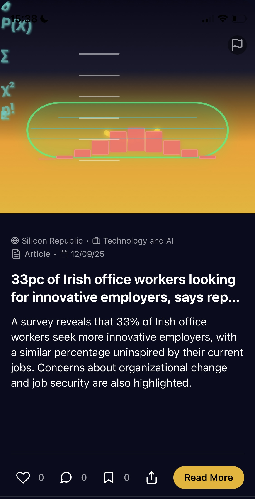
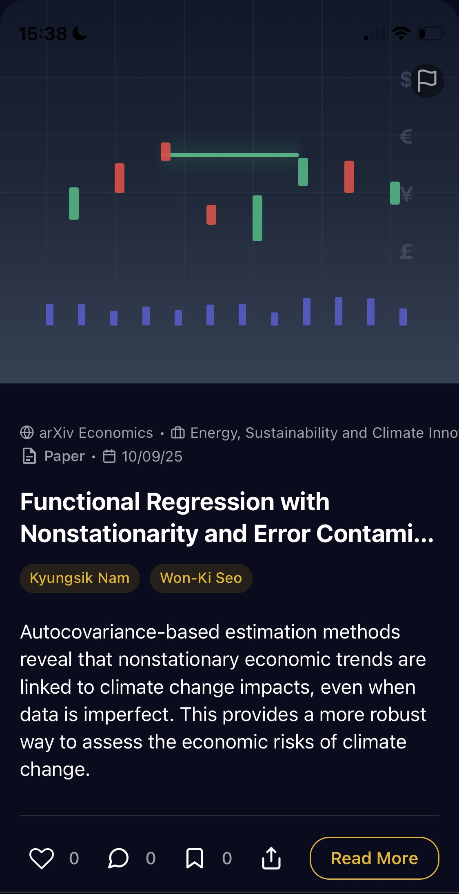

# Scrollwise

A React Native app that replaces the doomscroll with something you'd actually
want to have read. Same feed mechanics people are addicted to, pointed at
long-form ideas: articles, podcasts and books, surfaced by an agentic search
stack rather than an engagement optimiser.

Built with Expo (SDK 54) and Supabase. Shipped to the iOS App Store as
**[Supercharged: Grow Together](https://apps.apple.com/us/app/supercharged-grow-together/id6751821132)**
(v2.0.1, first released September 2025) — `scrollwise` was the internal codename
and is the name kept here.

<p align="left">
  
  
  
  
</p>

---

## The interesting part: hybrid retrieval

Search is the core of the product, and it is a genuine hybrid retrieval pipeline
rather than a `LIKE '%query%'` with extra steps.

**Two retrievers, run in parallel.** Semantic search embeds the query with Gemini
`text-embedding-004` and does a pgvector cosine-distance lookup, so *"how do I
stop procrastinating"* finds an article on habit loops that shares none of those
words. Lexical search uses Postgres full-text with `websearch_to_tsquery` and
`ts_rank_cd`, which handles the proper nouns and exact phrases that embeddings
routinely fumble.

**Fused with Reciprocal Rank Fusion.** The two retrievers produce scores on
incomparable scales, so combining them with a weighted sum would need constant
recalibration as the corpus grows. RRF sidesteps that entirely by reading only
rank:

```
score(d) = Σ  1 / (k + rank_L(d))        k = 60
          L
```

A document found by *both* retrievers outranks one that a single retriever loved,
which is exactly right for discovery. No per-corpus tuning.

→ [`supabase/functions/hybrid-search/index.ts`](supabase/functions/hybrid-search/index.ts)
· [`database/search_functions.sql`](database/search_functions.sql)

**Two engineering decisions worth calling out:**

- [`progressive-search`](supabase/functions/progressive-search/index.ts) returns
  lexical hits immediately, then the fused semantic results once the embedding
  round-trip resolves. Perceived latency collapses to the fast path while final
  quality still comes from both retrievers.
- [`smart-search`](supabase/functions/smart-search/index.ts) dispatches the two
  paths with `Promise.allSettled`, not `Promise.all`. A third-party embedding
  outage then costs semantic recall and nothing else, instead of erroring out a
  query Postgres could have answered alone.

---

## Architecture

```
Expo / React Native (expo-router)
        │
        ├── lib/searchService.ts        typed client for the search surface
        │
Supabase
        ├── Postgres + pgvector         embeddings, full-text indexes, RLS
        ├── Edge Functions (Deno) ×13   search, embeddings, notifications,
        │                               timelapse processing, onboarding
        └── Storage                     media
```

| | |
|---|---|
| **Mobile** | React Native 0.81, Expo SDK 54, expo-router, TypeScript |
| **Backend** | Supabase (Postgres, pgvector, Auth, Storage, Edge Functions on Deno) |
| **ML / retrieval** | Gemini `text-embedding-004`, pgvector, Postgres FTS, RRF |
| **Media** | expo-video, expo-camera, expo-image-manipulator |
| **Notifications** | expo-notifications, cron-driven batching with delivery receipts |
| **Analytics** | PostHog |
| **Delivery** | EAS Build / EAS Submit, TestFlight, App Store |

Roughly 160 components across 9 screen groups, 13 edge functions.

---

## Beyond search

- **Timelapse capture** — a background worker (`services/timelapse-worker`)
  processes user-recorded reading sessions off the main thread.
- **Push notifications** — batched via cron, with receipt checking so failed
  device tokens get pruned rather than silently retried forever.
- **Social graph** — follows, insight replies threaded into chats, streaks.
- **Row Level Security** throughout; the client holds only the publishable key.

---

## Status

Archived. This was the first product built under the Supercharged name; the
company has since moved to a different problem. Kept public as a portfolio piece.

The Supabase project it pointed at has been retired, so a fresh clone will not
connect to a live backend. The code is the artefact.
